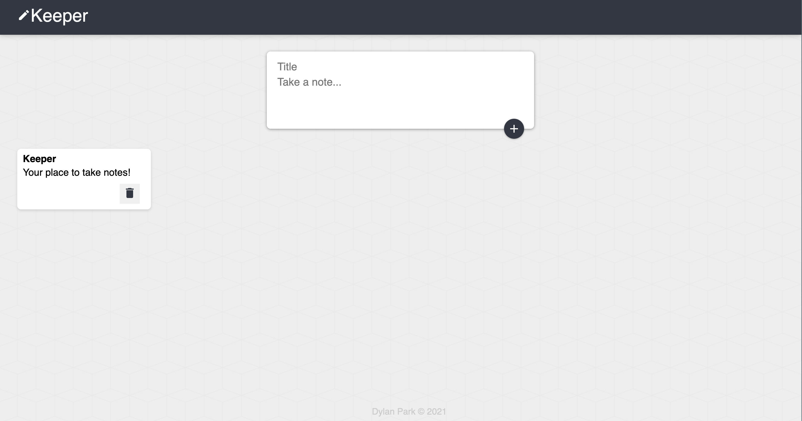

# Keeper-React

Keeper is a purely front-end note taking app made with React. Created during the 'Complete Web Development Bootcamp' offered by The App Brewery.

Created with [React](https://reactjs.org/).



## Getting Started

First:

```bash
cd keeper
```

Then:

```bash
npm install
```

Run the development server:

```bash
npm start
```

Open [http://localhost:3000](http://localhost:3000) with your browser to see the result.
